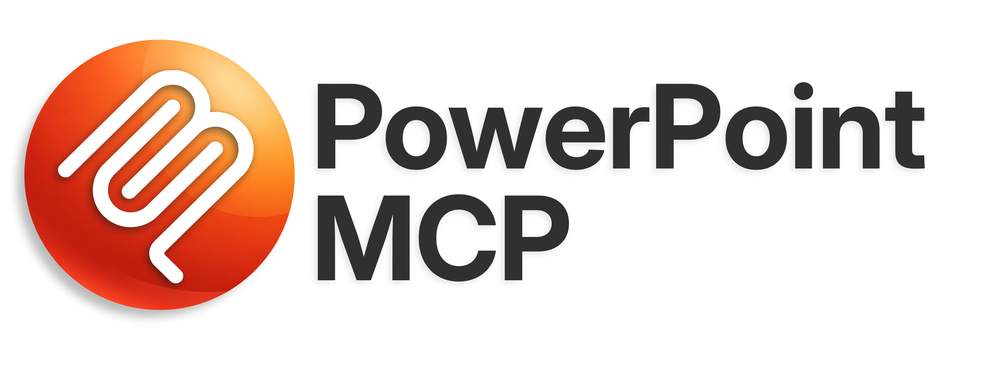

<p align="center">
  
</p>

<p align="center">
  <a href="README_ja.md">日本語版はこちら</a>
</p>

<p align="center">
  <a href="https://www.python.org/"></a>
  <a href="LICENSE"></a>
  
  <a href="https://modelcontextprotocol.io/"></a>
  
</p>

<p align="center">
  <strong>Real-time PowerPoint control through COM automation —<br>an MCP server with 131 tools for AI agents and developers.</strong>
</p>

---

An MCP (Model Context Protocol) server that gives AI agents and programs full control over a live Microsoft PowerPoint instance via COM automation. Unlike file-based libraries like python-pptx, this server interacts with a running PowerPoint application, providing real-time visual feedback and access to the complete PowerPoint API.

## Why This is Special

### Full PowerPoint Control — Not Just Read/Write

File-based libraries can only read and write `.pptx` files. COM automation unlocks everything PowerPoint can do:

- Start, control, and navigate slideshows
- Add and edit animations in real-time
- Embed video and audio media
- Create and modify SmartArt graphics
- Undo/redo operations
- Control views (normal, outline, notes, master)
- Manage comments for collaboration

### Designed for AI Agents

- **131 Tools Across 21 Categories** — From basic slide operations to advanced animations, SmartArt, and icon search
- **Explicit Presentation Targeting** — `ppt_activate_presentation` locks every tool to a specific file, so AI agents never accidentally edit the wrong presentation
- **Real-Time Visual Feedback** — Automatically navigates to the slide being edited so you see changes as they happen
- **Template Support** — Auto-detects personal templates folder, create presentations from any template
- **Material Symbols Icons** — Search 2,500+ Google Material Symbols icons by keyword and insert them as SVG with theme colors
- **Theme Color Awareness** — Use theme color names (`accent1`, `accent2`, etc.) instead of hardcoded RGB values
- **Text Precision** — `\n` for paragraph breaks (Enter), `\v` for line breaks (Shift+Enter) — full control over text flow
- **STA Thread Safety** — All COM operations run on a dedicated Single-Threaded Apartment worker thread for reliability

## Tool Categories

| Category | Tools | Description |
|----------|------:|-------------|
| **App** | 4 | Connect to PowerPoint, app info, window state, list presentations |
| **Presentation** | 8 | Create (with templates), open, save, close, info, activate target, list templates |
| **Slides** | 9 | Add, delete, duplicate, move, list, info, notes, navigation |
| **Shapes** | 10 | Add shapes/textboxes/pictures/lines, list, info, update, delete, z-order |
| **Text** | 8 | Set/get text, format text ranges, paragraph format, bullets, find/replace, textframe |
| **Placeholders** | 5 | List, get, set placeholder content |
| **Formatting** | 3 | Fill, line, shadow |
| **Tables** | 9 | Add tables, get/set cells, merge cells, add/delete rows/columns, styles |
| **Export** | 2 | PDF, images |
| **Slideshow** | 6 | Start, stop, next, previous, go to slide, status |
| **Charts** | 6 | Add charts, set/get data, format, series, change type |
| **Animation** | 5 | Transitions, add/list/remove/clear animations |
| **Themes** | 3 | Apply themes, get theme colors, headers/footers |
| **Groups** | 3 | Group, ungroup, get group items |
| **Connectors** | 2 | Add, format |
| **Hyperlinks** | 3 | Add, get, remove |
| **Sections** | 3 | Add, list, manage |
| **Properties** | 2 | Set/get presentation metadata |
| **Media** | 3 | Video, audio, media settings |
| **SmartArt** | 3 | Add, modify, list layouts |
| **Edit Operations** | 6 | Undo, redo, copy shapes/formatting between slides |
| **Layout** | 7 | Align, distribute, slide size, background, flip, merge shapes |
| **Effects** | 3 | Glow, reflection, soft edge |
| **Comments** | 3 | Add, list, delete |
| **Advanced** | 16 | Tags, fonts (set defaults + bulk replace), crop, shape export, visibility, selection, view, animation copy, picture from URL, SVG icons, icon search, aspect ratio lock |
| | **131** | |

## Prerequisites

- **Windows 10/11** — COM automation requires Windows
- **Microsoft PowerPoint** — Microsoft 365, Office 2021, 2019, etc.
- **Python 3.10+**
- **uv** — Fast Python package manager ([install guide](https://docs.astral.sh/uv/getting-started/installation/))

## Installation

### Option A: Install from PyPI (recommended)

```bash
pip install ppt-mcp
```

### Option B: Clone and run from source

```bash
git clone https://github.com/ykuwai/ppt-com-mcp.git
cd ppt-com-mcp
uv sync
```

## Usage

```bash
# PyPI install
ppt-mcp

# From source
uv run mcp run src/server.py

# Development mode (with MCP Inspector)
uv run mcp dev src/server.py
```

## MCP Client Configuration

Add the following to your MCP client config. For Claude Desktop, edit `%APPDATA%\Claude\claude_desktop_config.json`:

**PyPI install (recommended):**

```json
{
  "mcpServers": {
    "powerpoint": {
      "command": "uvx",
      "args": ["ppt-mcp"]
    }
  }
}
```

**From source:**

```json
{
  "mcpServers": {
    "powerpoint": {
      "command": "uv",
      "args": [
        "--directory",
        "C:\\path\\to\\ppt-com-mcp",
        "run",
        "mcp",
        "run",
        "src/server.py"
      ]
    }
  }
}
```

## Example Workflow

```python
# 1. Target a specific presentation (prevents editing the wrong file)
ppt_list_presentations()
ppt_activate_presentation(presentation_name="demo.pptx")

# 2. Create a slide from a personal template
ppt_list_templates()
ppt_create_presentation(template_path="C:\\...\\MyTemplate.potx")

# 3. Add a slide and set content
ppt_add_slide(layout_index=2)
ppt_set_text(slide_index=1, shape_name_or_index="Title 1", text="Hello World")

# 4. Set presentation-wide fonts (Latin + East Asian separately)
ppt_set_default_fonts(latin="Segoe UI", east_asian="Meiryo")

# 5. Insert a Material Symbols icon with theme color
ppt_add_svg_icon(slide_index=1, icon_name="rocket",
                 left=500, top=100, width=72, height=72,
                 color="accent1", style="rounded", filled=True)

# 6. Export to PDF
ppt_export_pdf(file_path="C:\\output\\presentation.pdf")
```

## Features in Detail

### Presentation Targeting

`ppt_activate_presentation` sets a session-level target so every subsequent tool call operates on that specific file — regardless of which window is active in PowerPoint. Switch targets anytime by calling it again.

```python
ppt_activate_presentation(presentation_name="report.pptx")
# All tools now operate on report.pptx
ppt_activate_presentation(presentation_name="demo.pptx")
# Switched — all tools now operate on demo.pptx
```

### Template Support

Auto-detects your personal PowerPoint templates folder (registry, OneDrive, or default paths). Use `ppt_list_templates` to discover available templates, then `ppt_create_presentation(template_path=...)` to create a new presentation from any template.

### Material Symbols Icons

Search 2,500+ icons with `ppt_search_icons(query="...")` and insert them as SVG with `ppt_add_svg_icon`:
- **3 styles**: outlined, rounded, sharp
- **Filled variants**: set `filled=True`
- **Theme colors**: `color="accent1"` uses the presentation's accent color
- **Auto-fit**: preserves aspect ratio within the specified area

### Real-Time Navigation

Every write operation automatically navigates PowerPoint to the target slide. You see changes happening in real-time — no need to manually switch slides.

### Text Formatting

- `\n` — Paragraph break (Enter). Each paragraph gets its own bullet/indent level.
- `\v` — Line break (Shift+Enter). Stays in the same paragraph, preserving formatting.
- Per-character formatting with `ppt_format_text_range`
- Auto-fit control: shrink text to fit, resize shape, or overflow

## License

MIT

## Credits

- [FastMCP](https://github.com/jlowin/fastmcp) — Pythonic MCP server framework
- [pywin32](https://github.com/mhammond/pywin32) — Windows COM automation
- [Model Context Protocol](https://modelcontextprotocol.io/) — by Anthropic
