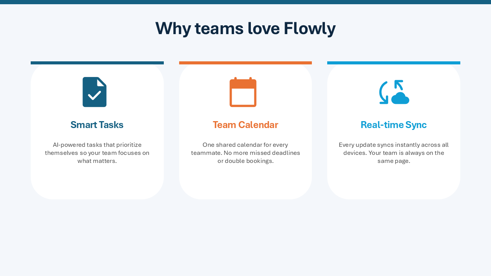
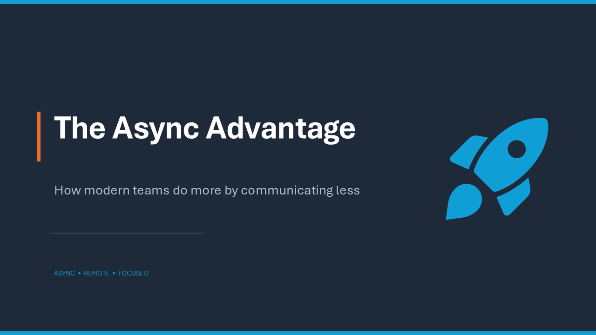
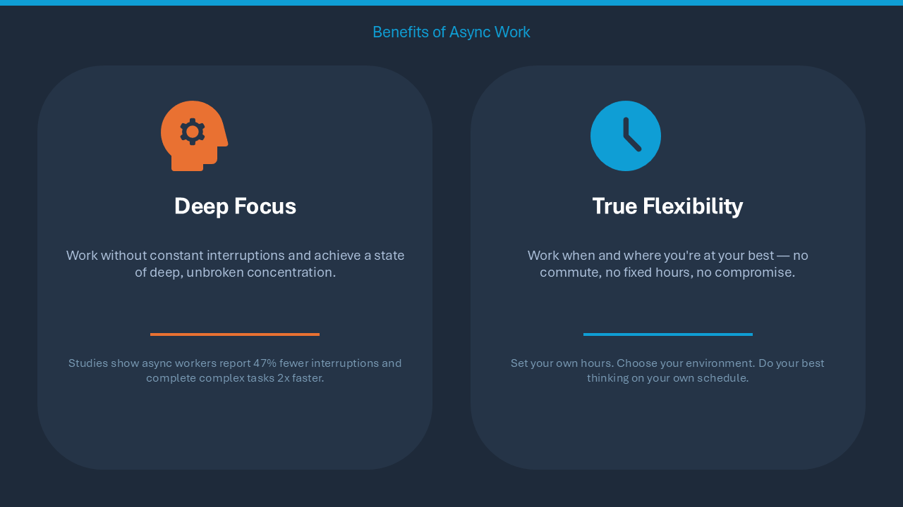
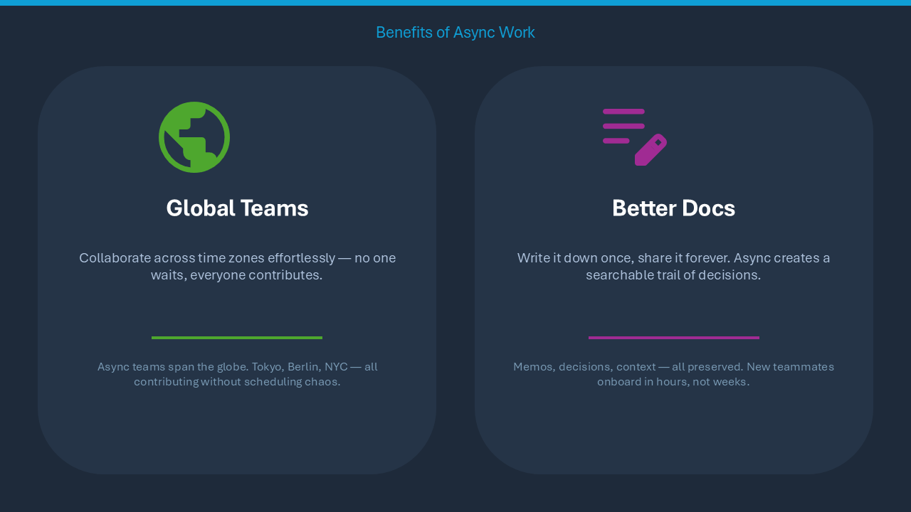
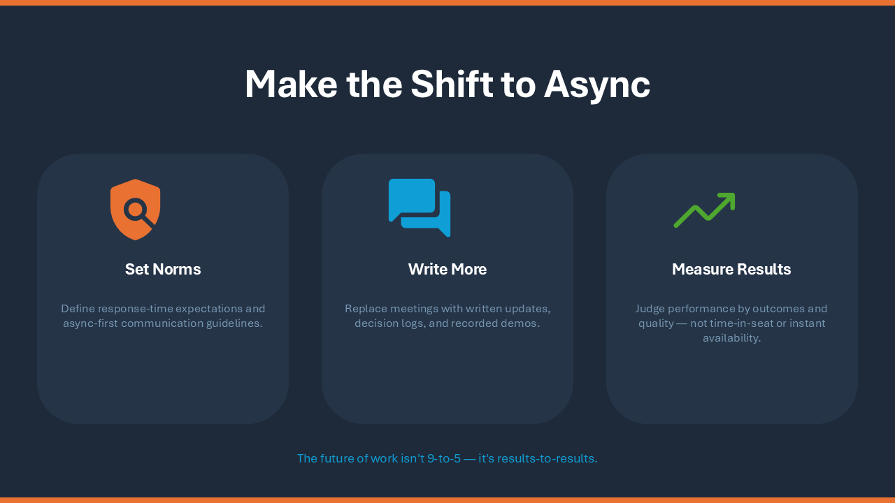
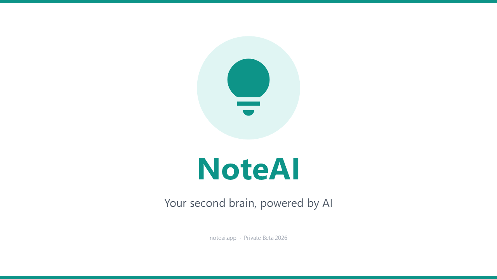
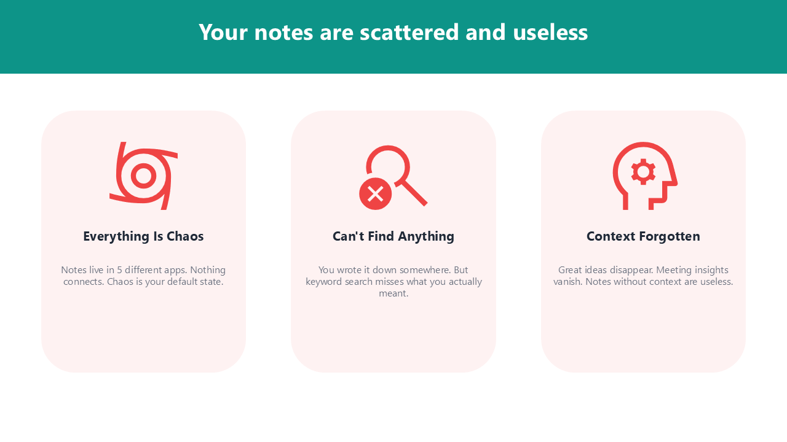
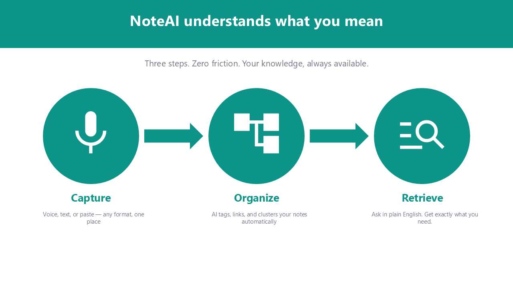
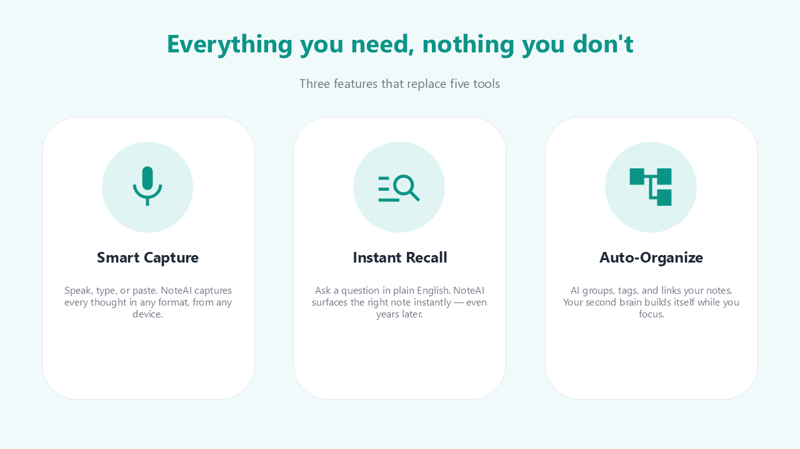
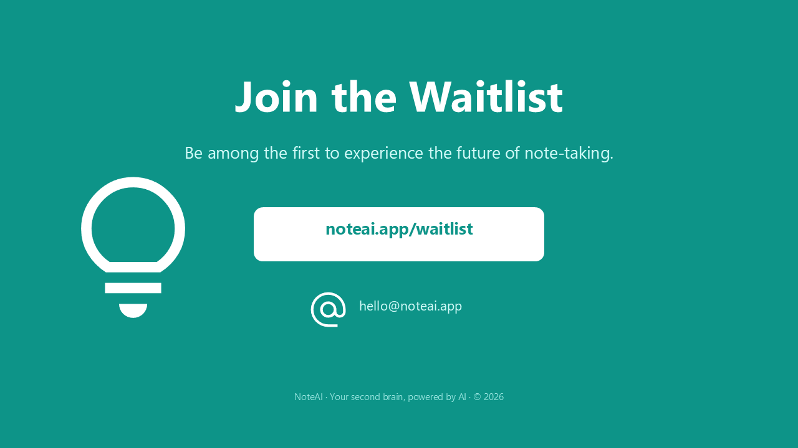

<p align="center">
  
</p>

<p align="center">
  <a href="README_ja.md">日本語版はこちら</a>
</p>

<p align="center">
  <a href="https://www.python.org/"></a>
  <a href="LICENSE"></a>
  
  <a href="https://pepy.tech/projects/ppt-mcp"></a>
</p>

<p align="center">
  <strong>Real-time PowerPoint control through COM automation —<br>an MCP server with 154 tools for AI agents and developers.</strong>
</p>

---

An MCP (Model Context Protocol) server that gives AI agents full control over a live Microsoft PowerPoint instance via COM automation. Unlike file-based libraries like python-pptx, this server interacts directly with a running PowerPoint application.

## ✨ Key Features

- **Real-time control** — Directly manipulates a running PowerPoint instance; changes appear instantly on screen
- **154 tools across 26 categories** — Slides, shapes, text, tables, charts, animations, SmartArt, media, freeform paths, and more
- **Safe for AI agents** — `ppt_activate_presentation` locks all tools to a specific file, preventing accidental edits to the wrong presentation
- **[Google Material Symbols](https://fonts.google.com/icons) icons** — Search 2,500+ icons by keyword and insert as SVG with theme colors
- **Theme color awareness** — Use `accent1`, `accent2`, etc. instead of hardcoded RGB values

## 📋 Requirements

- Windows 11
- Microsoft PowerPoint
- [uv](https://docs.astral.sh/uv/getting-started/installation/)

## 🚀 Getting Started

Standard config — works in Claude Desktop, Cursor, `.mcp.json`, and most other MCP clients:

```json
{
  "mcpServers": {
    "powerpoint": {
      "command": "uvx",
      "args": ["ppt-mcp"]
    }
  }
}
```

### Claude Code

**User-scoped** (available in all projects)
```bash
claude mcp add powerpoint uvx ppt-mcp
```

**Project-scoped** (stored in `.mcp.json`, shared with your team)
```bash
claude mcp add --scope project powerpoint uvx ppt-mcp
```

### Cursor

[](https://cursor.com/install-mcp?name=ppt-mcp&config=eyJ0eXBlIjoic3RkaW8iLCJjb21tYW5kIjoidXZ4IiwiYXJncyI6WyJwcHQtbWNwIl19)

Or add manually to `~/.cursor/mcp.json` using the standard config above.

### Claude Desktop

Edit `%APPDATA%\Claude\claude_desktop_config.json` using the standard config above.

### Codex

Edit `~/.codex/config.toml`:

```toml
[mcp_servers.ppt-mcp]
command = "uvx"
args = ["ppt-mcp"]
```

Or use the standard JSON config above in `.codex/config.json`.

### VS Code

```bash
code --add-mcp '{"name":"powerpoint","command":"uvx","args":["ppt-mcp"]}'
```

### From source

```bash
git clone https://github.com/ykuwai/ppt-mcp.git
cd ppt-mcp
uv sync
```

```json
{
  "mcpServers": {
    "powerpoint": {
      "command": "uv",
      "args": [
        "--directory",
        "C:\\path\\to\\ppt-mcp",
        "run",
        "mcp",
        "run",
        "src/server.py"
      ]
    }
  }
}
```

## 🛠️ Tool Categories

| Category | Tools | Description |
|----------|------:|-------------|
| **App** | 5 | Connect to PowerPoint, app info, active window, window state, list presentations |
| **Presentation** | 8 | Create (with templates), open, save, close, info, activate target, list templates |
| **Slides** | 9 | Add, delete, duplicate, move, list, info, notes, navigation |
| **Shapes** | 10 | Add shapes/textboxes/pictures/lines, list, info, update, delete, z-order |
| **Text** | 10 | Set/get text, format text ranges, paragraph format, bullets, find/replace, textframe, extract all text as Markdown, typography check |
| **Placeholders** | 6 | List, get, set placeholder content |
| **Formatting** | 3 | Fill, line, shadow |
| **Tables** | 13 | Add tables, get/set cells, batch set data, merge/split cells, add/delete rows/columns, styles, layout, borders |
| **Export** | 3 | PDF, images, slide preview, clipboard copy |
| **Slideshow** | 6 | Start, stop, next, previous, go to slide, status |
| **Charts** | 6 | Add charts, set/get data, format, series, change type |
| **Animation** | 6 | Transitions, add/list/update/remove/clear animations (entrance, exit, emphasis, motion path, interactive sequences) |
| **Themes** | 4 | Apply themes, get/set theme colors, headers/footers |
| **Groups** | 3 | Group, ungroup, get group items |
| **Connectors** | 2 | Add, format |
| **Hyperlinks** | 3 | Add, get, remove |
| **Sections** | 3 | Add, list, manage |
| **Properties** | 2 | Set/get presentation metadata |
| **Media** | 3 | Video, audio, media settings |
| **SmartArt** | 3 | Add, modify, list layouts |
| **Edit Operations** | 6 | Undo, redo, copy shapes/formatting between slides |
| **Layout** | 7 | Align, distribute, slide size, background, flip, merge shapes |
| **Effects** | 3 | Glow, reflection, soft edge |
| **Comments** | 3 | Add, list, delete |
| **Advanced** | 19 | Tags, fonts (set defaults + bulk replace), crop, picture format, shape export, visibility, selection, view, animation copy, picture from URL, SVG icons, icon search, aspect ratio lock, batch apply, default shape style |
| **Freeform** | 7 | Build freeform paths, get/set node positions, insert/delete nodes, node editing type, segment type |
| | **154** | |

## 💡 Example Prompts

Just describe what you want in plain language — no code required.

---

**Simple** — topic only

> *"Create a 3-slide intro deck for a productivity app called Flowly."*

<details>
<summary>View slides</summary>
<br>



</details>

---

**With style direction** — topic + visual style

> *"Make a 4-slide presentation on the benefits of async work. Dark navy style, add icons for each benefit."*

<details>
<summary>View slides</summary>
<br>




</details>

---

**Detailed** — topic + design intent + slide structure

> *"Build a 5-slide pitch for an AI note-taking app called NoteAI. White background, teal accent. Slides: title, problem, solution, features with icons, closing."*

<details>
<summary>View slides</summary>
<br>





</details>

---

**Design keywords that elevate results:**

| Aspect | Keywords / Phrases | What it does |
|---|---|---|
| **Icons** | `add icons` · `icon for each point` · `use icons throughout` | Searches Google Material Symbols and places crisp SVG icons automatically |
| **Color scheme** | `dark navy` · `white background` · `monochrome` · `light gray` | Sets the overall color palette and mood |
| **Accent color** | `teal accent` · `blue accent` · `brand color #2563EB` | Applies a specific highlight color to headings, icons, and shapes |
| **Style tone** | `modern minimal` · `bold and vibrant` · `clean and professional` · `playful` | Signals the overall visual personality |
| **Deck type** | `pitch deck` · `investor presentation` · `workshop slides` · `status report` | Guides layout and content density toward the intended purpose |
| **Slide structure** | `Slides: title, problem, solution, features, CTA` · `4 slides` | Defines the narrative arc and slide count up front |
| **Layout** | `card layout` · `two-column` · `centered` · `full-bleed background` | Shapes how content is arranged on each slide |
| **Text density** | `minimal text` · `one message per slide` · `bullet points` | Controls how much text appears and how it's formatted |
| **Backgrounds** | `gradient background` · `solid dark background` · `soft light background` | Specifies the background treatment across slides |
| **Emphasis** | `highlight key numbers` · `bold headings` · `accent bar on each slide` | Draws attention to the most important information |

## 🔍 Features in Detail

### 🎯 Presentation Targeting

`ppt_activate_presentation` sets a session-level target so every subsequent tool call operates on that specific file — regardless of which window is active in PowerPoint. Switch targets anytime by calling it again.

```python
ppt_activate_presentation(presentation_name="report.pptx")
# All tools now operate on report.pptx
ppt_activate_presentation(presentation_name="demo.pptx")
# Switched — all tools now operate on demo.pptx
```

### 📁 Template Support

Auto-detects your personal PowerPoint templates folder (registry, OneDrive, or default paths). Use `ppt_list_templates` to discover available templates, then `ppt_create_presentation(template_path=...)` to create a new presentation from any template.

### 🎨 Google Material Symbols Icons

Search 2,500+ [Google Material Symbols](https://fonts.google.com/icons) icons with `ppt_search_icons(query="...")` and insert them as SVG with `ppt_add_svg_icon`:
- **3 styles**: outlined, rounded, sharp
- **Filled variants**: set `filled=True`
- **Theme colors**: `color="accent1"` uses the presentation's accent color
- **Auto-fit**: preserves aspect ratio within the specified area

### ⚡ Real-Time Navigation

Every write operation automatically navigates PowerPoint to the target slide. You see changes happening in real-time — no need to manually switch slides.

### ✍️ Text Formatting

- `\n` — Paragraph break (Enter). Each paragraph gets its own bullet/indent level.
- `\v` — Line break (Shift+Enter). Stays in the same paragraph, preserving formatting.
- Per-character formatting with `ppt_format_text_range`
- Auto-fit control: shrink text to fit, resize shape, or overflow

### 🎨 Theme Color Presets & Auto-Generation

`ppt_set_theme_colors` supports three modes:
- **17 curated presets** — WCAG AA accessible palettes across 5 categories: Classic (`corporate_blue`, `executive`, `consulting`), Design Systems (`tailwind`, `chakra`, `open_color`, `radix`), Nature (`ocean`, `forest`, `sunset`, `sage`), Modern (`nord_light`, `pastel_deep`, `swiss`), Vibrant (`vivid`, `rainbow`, `neon_safe`)
- **Primary color generation** — provide a single brand color (`primary="#2B579A"`) to auto-generate a full harmonious palette using color harmony (split-complementary + analogous)
- **Manual** — set individual color slots (`accent1`, `accent2`, etc.)

Modes can be combined: use a preset as a base and override specific slots. All accents are guaranteed 3:1+ contrast on white.

### 🔍 Typography Check

`ppt_check_typography` detects and optionally auto-fixes common typography issues:
- **Widow lines** — isolated 1-3 character lines caused by word wrapping
- **Short lines after soft returns** — side effects of manual line breaks (`\v`)
- **Auto-shrunk text** — text silently compressed by PowerPoint's shrink-to-fit feature

Auto-fix strategies include widening text boxes and inserting soft returns.

## ⚙️ Advanced Configuration

### Handling PowerPoint Modal Dialogs

When PowerPoint has a modal dialog open (e.g., SmartArt layout picker, Save dialog, Insert dialog), COM calls return `RPC_E_CALL_REJECTED`. The MCP server **automatically retries for up to 15 seconds** (5 retries × 3 s), so the server stays connected and responsive even when a dialog is blocking PowerPoint.

**Auto-dismiss (opt-in):** By default, the server waits for you to close the dialog manually. To have the server automatically send ESC on the first retry — dismissing the dialog without user interaction — set `PPT_AUTO_DISMISS_DIALOG=true`:

```json
{
  "mcpServers": {
    "powerpoint": {
      "command": "uvx",
      "args": ["ppt-mcp"],
      "env": {
        "PPT_AUTO_DISMISS_DIALOG": "true"
      }
    }
  }
}
```

ESC cancels without committing, so there are no destructive side effects. This is particularly useful in automated workflows where no human is present to close dialogs.

## 📄 License

MIT

## 🙏 Credits

- [FastMCP](https://github.com/jlowin/fastmcp) — Pythonic MCP server framework
- [pywin32](https://github.com/mhammond/pywin32) — Windows COM automation
- [Model Context Protocol](https://modelcontextprotocol.io/) — by Anthropic
