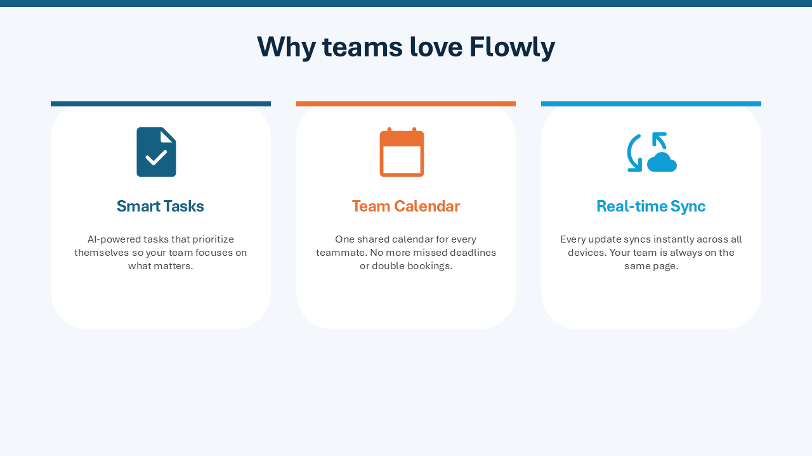
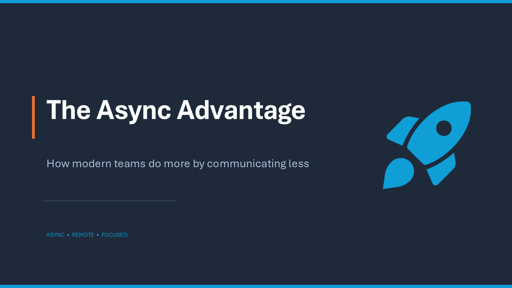
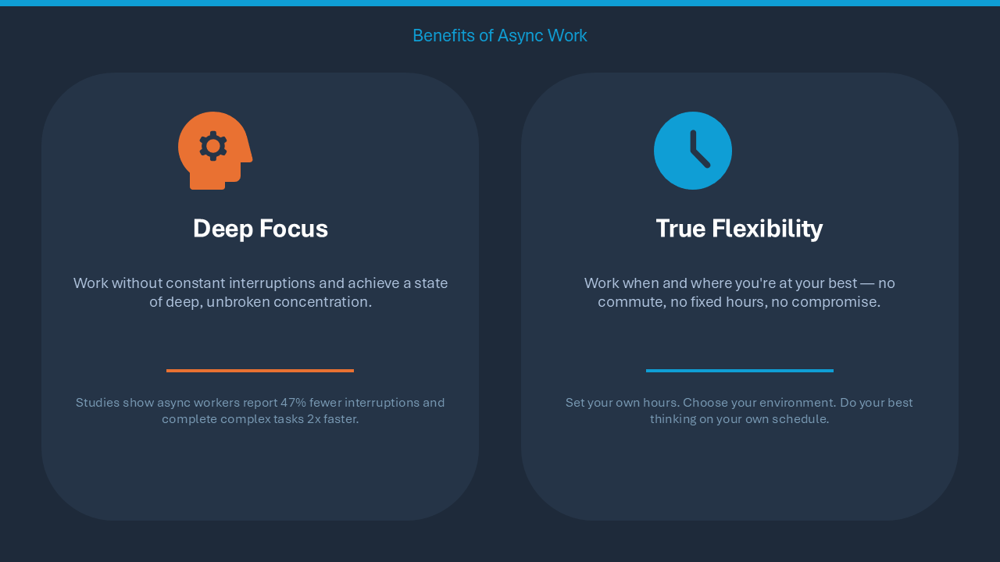
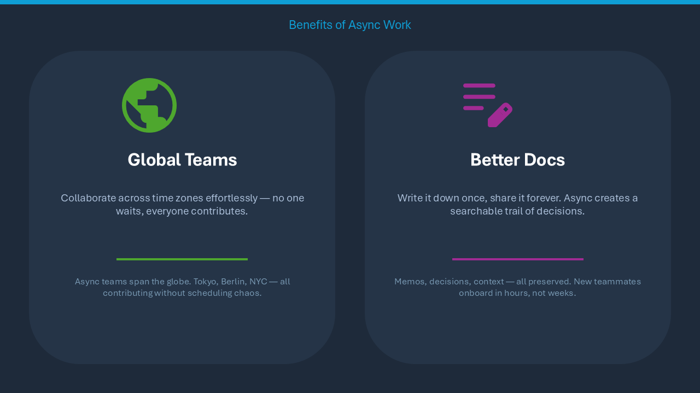
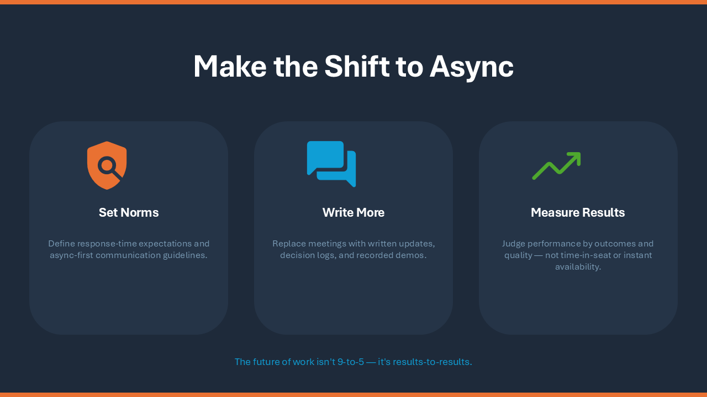
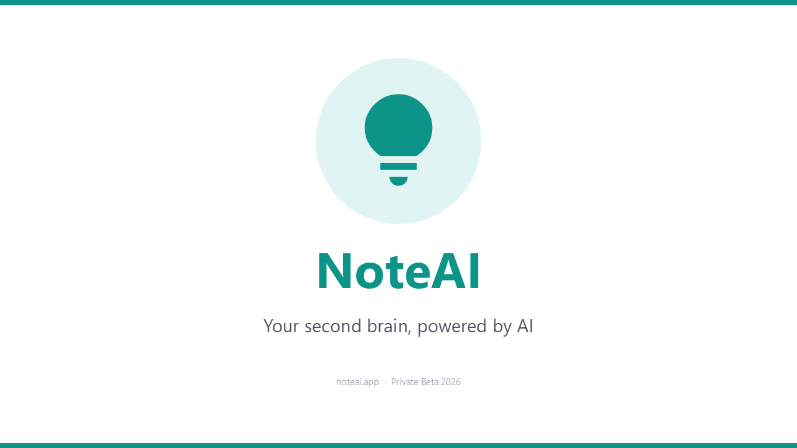
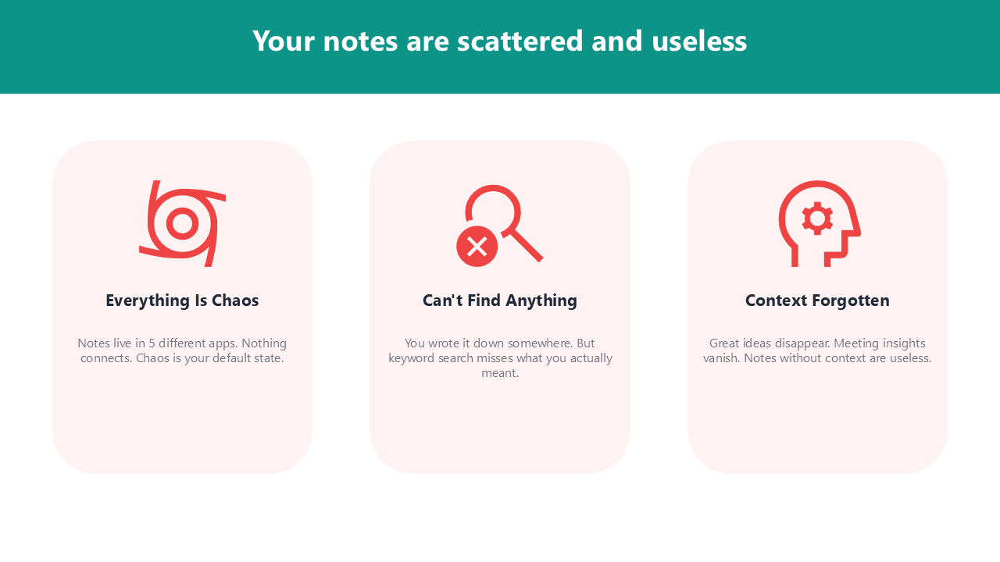
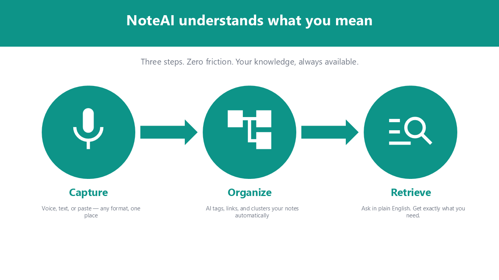
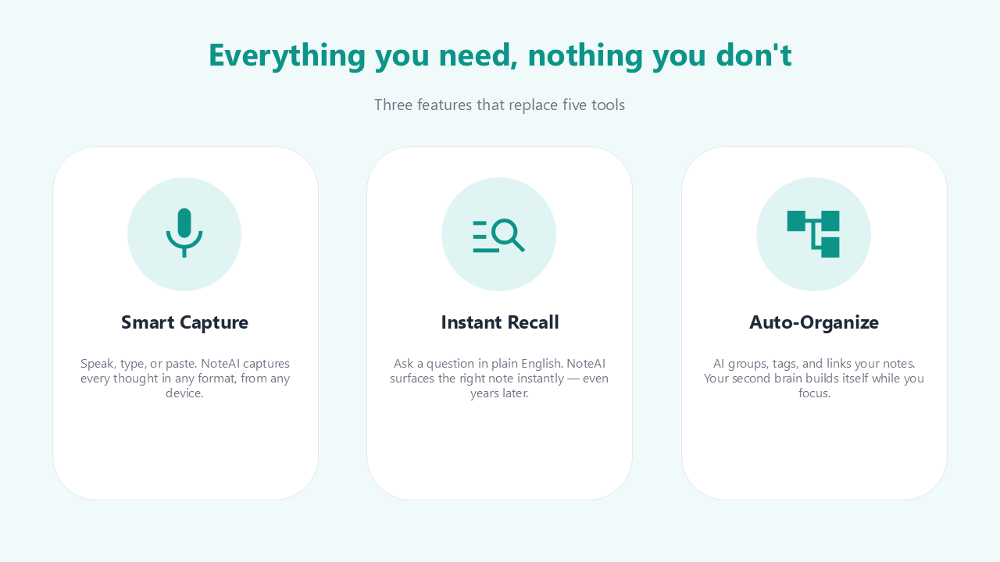
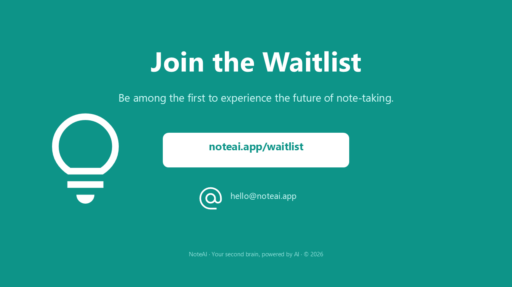

<p align="center">
  
</p>

<p align="center">
  <a href="README.md">English version</a>
</p>

<p align="center">
  <a href="https://www.python.org/"></a>
  <a href="LICENSE"></a>
  
  <a href="https://pepy.tech/projects/ppt-mcp"></a>
</p>

<p align="center">
  <strong>COM自動化によるPowerPointのリアルタイム制御 —<br>AIエージェントと開発者のための156ツールを備えたMCPサーバー</strong>
</p>

---

PowerPointをCOM自動化で完全に制御するMCP（Model Context Protocol）サーバーです。python-pptxのようなファイルベースのライブラリとは異なり、起動中のPowerPointアプリケーションと直接やり取りします。

## 🎬 デモ

エージェントが実際の PowerPoint ウィンドウでスライドを作成する様子（15倍速）:

https://github.com/user-attachments/assets/178b9b5b-624d-4de0-a1dd-619dc13d4bd7

## ✨ 主な特徴

- **リアルタイム制御** — 起動中のPowerPointを直接操作。変更がその場で画面に反映される
- **26カテゴリ・156ツール** — スライド、シェイプ、テキスト、テーブル、グラフ、アニメーション、SmartArt、メディア、フリーフォームパスなど
- **AIエージェントに安全** — `ppt_activate_presentation` で操作対象ファイルを固定。誤って別のプレゼンを編集するミスを防止
- **[Google Material Symbols](https://fonts.google.com/icons) アイコン** — 2,500以上のアイコンをキーワード検索し、テーマカラーでSVG挿入
- **テーマカラー連携** — RGB値のハードコードではなく `accent1`、`accent2` などのテーマカラー名で指定

## 📋 動作環境

- Windows 11、または macOS（Apple Silicon と Intel のどちらも可）
- Microsoft PowerPoint
- [uv](https://docs.astral.sh/uv/getting-started/installation/)

macOS では COM ではなく Apple Event で PowerPoint を動かします。最初のツール
呼び出しで OS の自動化の許可を求めるダイアログが出るので、そこで PowerPoint を
一度許可してください。違いは [macOS 対応](#-macos-対応) にまとめてあります。

## 🚀 はじめかた

ほとんどの MCP クライアント（Claude Desktop、Cursor、`.mcp.json` など）で使える標準設定：

```json
{
  "mcpServers": {
    "powerpoint": {
      "command": "uvx",
      "args": ["ppt-mcp"]
    }
  }
}
```

### Claude Code

**ユーザースコープ**（全プロジェクトで利用可能）
```bash
claude mcp add powerpoint uvx ppt-mcp
```

**プロジェクトスコープ**（`.mcp.json` に保存、チームで共有可能）
```bash
claude mcp add --scope project powerpoint uvx ppt-mcp
```

### Cursor

[](https://cursor.com/install-mcp?name=ppt-mcp&config=eyJ0eXBlIjoic3RkaW8iLCJjb21tYW5kIjoidXZ4IiwiYXJncyI6WyJwcHQtbWNwIl19)

または `~/.cursor/mcp.json` に上記の標準設定を追加。

### Claude Desktop

`%APPDATA%\Claude\claude_desktop_config.json` に上記の標準設定を追加。

### Codex

`~/.codex/config.toml` を編集：

```toml
[mcp_servers.ppt-mcp]
command = "uvx"
args = ["ppt-mcp"]
```

または上記の標準設定を `.codex/config.json` に記述しても動作します。

### VS Code

```bash
code --add-mcp '{"name":"powerpoint","command":"uvx","args":["ppt-mcp"]}'
```

### ソースから実行

```bash
git clone https://github.com/ykuwai/ppt-mcp.git
cd ppt-mcp
uv sync
```

```json
{
  "mcpServers": {
    "powerpoint": {
      "command": "uv",
      "args": [
        "--directory",
        "C:\\path\\to\\ppt-mcp",
        "run",
        "mcp",
        "run",
        "src/server.py"
      ]
    }
  }
}
```

## 🛠️ ツール一覧

| カテゴリ | ツール数 | 主な機能 |
|---------|-------:|---------|
| **アプリケーション** | 5 | PowerPoint接続、アプリ情報、アクティブウィンドウ、ウィンドウ状態、プレゼン一覧 |
| **プレゼンテーション** | 8 | 作成（テンプレート対応）、開く、保存、閉じる、情報取得、操作対象指定、テンプレート一覧 |
| **スライド** | 10 | 追加、削除（一括）、複製（位置指定・複数）、移動（一括）、コピー（プレゼン間）、一覧、情報取得、ノート、ナビゲーション |
| **シェイプ** | 10 | 図形/テキストボックス/画像/線の追加、一覧、情報取得、更新、削除、Z順序 |
| **テキスト** | 10 | テキスト設定/取得、書式設定、段落書式、箇条書き、検索置換、テキストフレーム、全テキストMarkdown抽出、組版チェック |
| **プレースホルダー** | 6 | 一覧、情報取得、テキスト設定 |
| **書式設定** | 3 | 塗りつぶし、線、影 |
| **テーブル** | 13 | テーブル追加、セル取得/設定、一括データ設定、セル結合/分割、行/列の追加/削除、スタイル、レイアウト、罫線 |
| **エクスポート** | 4 | PDF、画像、スライドプレビュー、クリップボードコピー |
| **スライドショー** | 6 | 開始、停止、次へ、前へ、スライド移動、状態取得 |
| **グラフ** | 7 | グラフ追加、データ設定/取得、書式設定、軸書式設定、系列設定、種類変更 |
| **アニメーション** | 6 | トランジション、アニメーション追加/一覧/更新/削除/全削除（入口・退出・強調・モーションパス・インタラクティブシーケンス対応） |
| **テーマ** | 4 | テーマ適用、テーマカラー取得/設定、ヘッダー/フッター設定 |
| **グループ** | 3 | グループ化、グループ解除、グループ項目取得 |
| **コネクタ** | 2 | 追加、書式設定 |
| **ハイパーリンク** | 3 | 追加、取得、削除 |
| **セクション** | 3 | 追加、一覧、管理 |
| **プロパティ** | 2 | プレゼンテーションメタデータの設定/取得 |
| **メディア** | 3 | ビデオ、オーディオ、メディア設定 |
| **SmartArt** | 3 | 追加、編集、レイアウト一覧 |
| **編集操作** | 6 | 元に戻す、やり直し、スライド間シェイプ/書式コピー |
| **レイアウト** | 7 | 整列、分散配置、スライドサイズ、背景、反転、シェイプ結合 |
| **視覚効果** | 3 | グロー、反射、ぼかし |
| **コメント** | 3 | 追加、一覧、削除 |
| **高度な操作** | 19 | タグ、フォント一括設定/置換、トリミング、画像フォーマット、シェイプエクスポート、表示/非表示、選択、ビュー、アニメーションコピー、URL画像、SVGアイコン、アイコン検索、縦横比ロック、一括書式設定、デフォルト図形スタイル設定 |
| **フリーフォーム** | 7 | パス形状の作成、ノード位置の取得/移動、ノードの挿入/削除、編集タイプ変更、セグメントタイプ変更 |
| | **156** | |

## 💡 プロンプト例

日本語でそのまま伝えるだけ — コードは不要です。

---

**シンプル** — テーマだけ指定

> *「Flowlyというアプリの紹介スライドを3枚作って。」*

<details>
<summary>スライドを見る</summary>
<br>



</details>

---

**スタイル指定あり** — テーマ＋ビジュアルの方向性

> *「非同期ワークのメリットについて4枚スライドを作って。ダークネイビースタイルで、各メリットにアイコンを入れて。」*

<details>
<summary>スライドを見る</summary>
<br>




</details>

---

**詳細指定** — テーマ＋デザインイメージ＋スライド構成

> *「NoteAIというAIメモアプリの5枚ピッチを作って。白背景・ティールアクセント。スライド構成：タイトル・課題・解決策・機能（アイコン付き）・クロージング。」*

<details>
<summary>スライドを見る</summary>
<br>





</details>

---

**クオリティを上げるデザインキーワード：**

| 観点 | 単語やフレーズ例 | 詳細 |
|---|---|---|
| **アイコン** | `アイコンを入れて` · `各ポイントにアイコン` · `全スライドにアイコン` | Google Material Symbols を自動検索してSVGアイコンを配置 |
| **カラースキーム** | `ダークネイビー` · `白背景` · `モノクロ` · `ライトグレー` | 全体のカラーパレットと雰囲気を設定 |
| **アクセントカラー** | `ティールアクセント` · `ブルーアクセント` · `ブランドカラーは #2563EB` | 見出しやアイコン、図形に適用する強調色を指定 |
| **スタイル・トーン** | `モダンでミニマル` · `ビビッドでインパクト重視` · `クリーンでプロフェッショナル` · `カジュアル` | デザイン全体のテイストを指定 |
| **用途・目的** | `ピッチデッキ` · `投資家向けプレゼン` · `ワークショップ資料` · `進捗報告` | 目的に応じたレイアウトとコンテンツ密度に誘導 |
| **スライド構成** | `構成：タイトル・課題・解決策・機能・CTA` · `4枚で` | 構成とスライド数を最初に明示 |
| **レイアウト** | `カードレイアウト` · `2カラム` · `センタリング` · `全面背景` | 各スライドのコンテンツ配置を指定 |
| **テキスト量** | `テキストは最小限` · `1スライド1メッセージ` · `箇条書き` | 情報量とテキストスタイルを制御 |
| **背景** | `グラデーション背景` · `ダーク単色背景` · `ソフトな明るい背景` | 背景の処理を全体に指定 |
| **強調** | `数字を強調` · `太い見出し` · `各スライドにアクセントバー` | 重要な情報への視線の誘導を指定 |

## 🔍 機能の詳細

### 🎯 プレゼンテーション操作対象の指定

`ppt_activate_presentation` でセッションレベルの操作対象を設定すると、以降のすべてのツールがそのファイルに対して動作します。PowerPointのウィンドウが切り替わっても影響を受けません。再度呼び出すことで対象を切り替えられます。

```python
ppt_activate_presentation(presentation_name="report.pptx")
# 以降のツールはすべて report.pptx を操作
ppt_activate_presentation(presentation_name="demo.pptx")
# 切り替え — 以降は demo.pptx を操作
```

### 📁 テンプレート対応

個人用のPowerPointテンプレートフォルダを自動検出します（レジストリ、OneDrive、デフォルトパスを順に確認）。`ppt_list_templates` でテンプレートを一覧し、`ppt_create_presentation(template_path=...)` で任意のテンプレートから新規プレゼンテーションを作成できます。

### 🎨 Google Material Symbolsアイコン

`ppt_search_icons(query="...")` で2,500以上の[Google Material Symbols](https://fonts.google.com/icons)アイコンをキーワード検索し、`ppt_add_svg_icon` でSVG画像として挿入：
- **3つのスタイル**: outlined、rounded、sharp
- **塗りつぶしバリアント**: `filled=True` で指定
- **テーマカラー**: `color="accent1"` でプレゼンのアクセントカラーを自動適用
- **自動フィット**: 指定エリア内でアスペクト比を保持

### ⚡ リアルタイムナビゲーション

書き込み操作のたびに、PowerPointの画面が自動的に対象スライドに移動します。変更がリアルタイムで目の前に表示されるため、手動でスライドを切り替える必要はありません。

### ✍️ テキスト制御

- `\n` — 改段落（Enter）。段落ごとに独自の箇条書き・インデントレベルを持つ
- `\v` — 改行（Shift+Enter）。同じ段落内に留まり、書式を維持
- `ppt_format_text_range` で文字単位の書式設定
- 自動調整: テキストをシェイプに収める、シェイプをリサイズ、またはオーバーフロー

### 🎨 テーマカラーのプリセット・自動生成

`ppt_set_theme_colors` は3つのモードに対応：
- **17種のプリセット** — WCAG AAアクセシブルなパレット。5カテゴリ: Classic（`corporate_blue`, `executive`, `consulting`）、Design Systems（`tailwind`, `chakra`, `open_color`, `radix`）、Nature（`ocean`, `forest`, `sunset`, `sage`）、Modern（`nord_light`, `pastel_deep`, `swiss`）、Vibrant（`vivid`, `rainbow`, `neon_safe`）
- **プライマリカラー生成** — ブランドカラー1色（`primary="#2B579A"`）からカラーハーモニー（分割補色 + 類似色）を使って調和のとれた配色を自動生成
- **手動指定** — 個別のカラースロット（`accent1`, `accent2` など）を直接設定

モードは組み合わせ可能：プリセットをベースに特定のスロットだけ上書きできます。すべてのアクセントカラーは白背景に対して3:1以上のコントラスト比を保証。

### 🔍 組版チェック

`ppt_check_typography` はよくある組版の問題を検出し、自動修正も可能：
- **ウィドウ行** — 折り返しにより1〜3文字だけの行が発生した状態
- **改行後の短い行** — 手動改行（`\v`）後の短すぎる行
- **自動縮小テキスト** — PowerPointの「テキストに合わせて縮小」で暗黙的に圧縮されたテキスト

自動修正はテキストボックスの拡幅やソフトリターン挿入で対応します。

## ⚙️ 詳細設定

### PowerPointのモーダルダイアログへの対応

PowerPointのモーダルダイアログ（SmartArt レイアウト選択、保存ダイアログ、挿入ダイアログなど）が開いているとき、COMの呼び出しは `RPC_E_CALL_REJECTED` を返します。MCPサーバーは**最大15秒（5回 × 3秒）自動的にリトライ**するため、ダイアログが表示されていてもサーバー接続が安定して維持されます。

**自動ESCによるダイアログ閉じ（オプトイン）：** デフォルトでは、ユーザーが手動でダイアログを閉じるのを待ちます。最初のリトライ時にESCキーを自動送信してダイアログを閉じさせるには、`PPT_AUTO_DISMISS_DIALOG=true` を設定してください：

```json
{
  "mcpServers": {
    "powerpoint": {
      "command": "uvx",
      "args": ["ppt-mcp"],
      "env": {
        "PPT_AUTO_DISMISS_DIALOG": "true"
      }
    }
  }
}
```

ESCは変更を確定せずにキャンセルするため、意図しない操作は発生しません。人間が操作しない自動化ワークフローで特に有用です。

## 🍎 macOS 対応

**macOS で断るツールは 12 です。残りは動きます。**その 12 は
[MACOS_PORT.md](MACOS_PORT.md) の 6.1 に名前で並べてあり、
その一覧が古びないようにテストで見張っています。

ツールも引数も返り値も Windows と同じです。違うのは PowerPoint for Mac の
スクリプト辞書が届く範囲だけで、届かないところではツールがそう答えます。
黙って何もしなかったことにはしません。

macOS でできないこと。

- **SmartArt。** 辞書にクラスもコマンドもないので、スクリプトからは作ることも
  編集することもできません。すでに置いてあるものは、ただの図形として
  動かしたり読んだり消したりできます
- **フリーフォームの頂点の編集タイプ。** 角、スムーズ、対称という区別は
  スクリプトから届く場所のどこにも記録されていません。代わりにハンドルの
  頂点を動かしてください
- **アニメーションを1つだけ削除。** スライドごと消すことはできます
- **タグ、`ppt_select_shapes`、`ppt_set_table_style`、`ppt_execute_mso`。**
  どれも辞書に届く手段がありません

細かい違い。

- **ツールは1つずつ順番に呼んでください。**同じ返信で並べて呼ばないでください。
  PowerPoint に届くのは一度に1つだけなので、残りは後ろに並んで待ちます。
  出てくる順番は届いた順のままです。待たされすぎた呼び出しは取り下げられ、
  何も変えないままそう答えます
- 対応するものがない引数を渡すと、その引数を名指しして断ります。
  たとえばハイパーリンクのスクリーンチップです。外して呼び直せば通ります
- **動画と音声はファイルを埋め込みます。リンクはできません。**再生の設定は
  8つのうち繰り返しと再生していないときに隠すの2つだけです。隠す方は
  アニメーションのあるスライドでは断ります。書き込むとそのスライドの
  アニメーションを作り替えてしまうからです
- PowerPoint はサンドボックスの中にいて任意のフォルダーに書けないので、
  書き出しは PowerPoint 自身の容器を経由して取り出します
- スライド画像は PNG 書き出しではなく PDF から描画しています。
  Windows の経路より鮮明です
- 自動化の許可はサーバーを起動したアプリに紐づきます。別のターミナルや
  エディターから起動すると、もう一度許可を求められます
- こまめに保存してください。損はありませんし、スクリプトの後ろで
  サンドボックスの確認が出たときに、PowerPoint が開いている書類を全部閉じて
  そのまま終了した例があります
  ([#191](https://github.com/ykuwai/ppt-mcp/issues/191))
- **グラフとフリーフォームとグループ化はクリップボード経由です。**操作の間だけ
  クリップボードを借りて、終わったら元に戻します。辞書にこの3つを表す言葉が
  ないので、こうして届かせています
- **すでにあるグラフやパスを直すと、図形が作り直されます。**グラフのデータ、
  種類、タイトル、凡例、軸、系列のツールと、頂点のツールは、図形をコピーして
  書き換え、貼り直してから元を消します。名前、位置、重なり順は保たれますが、
  その図形についていたアニメーションは残らず、いくつ消えたかを返り値で
  伝えます。グラフの描画サイズに依存する引数 (`chart_style`、凡例と
  タイトルの座標、8方向の凡例位置、`tick_label_font_size`) は引数名を挙げて
  断ります
- アイコンは挿入前に `sips` で PNG にしています。PowerPoint for Mac は SVG を
  読めないからです。macOS 13 以降が必要で、それより古いと空の四角ではなく
  理由を書いた拒否が返ります

## 📄 ライセンス

MIT

## 🙏 クレジット

- [FastMCP](https://github.com/jlowin/fastmcp) — Python MCPサーバーフレームワーク
- [pywin32](https://github.com/mhammond/pywin32) — Windows COM自動化
- [appscript](https://github.com/hhas/appscript) — macOS Apple Event ブリッジ
- [Model Context Protocol](https://modelcontextprotocol.io/) — by Anthropic
